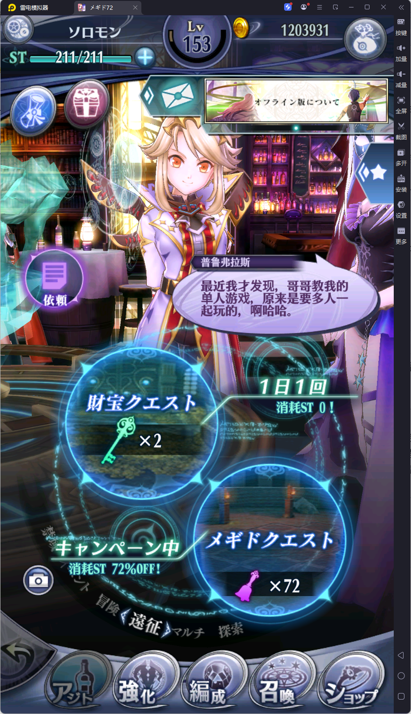
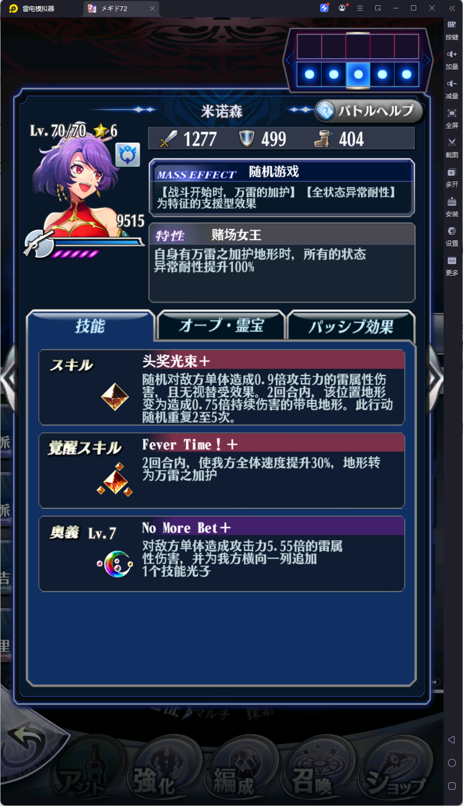
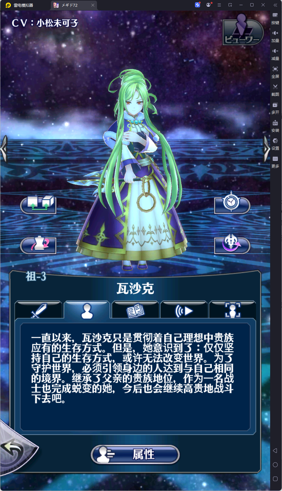
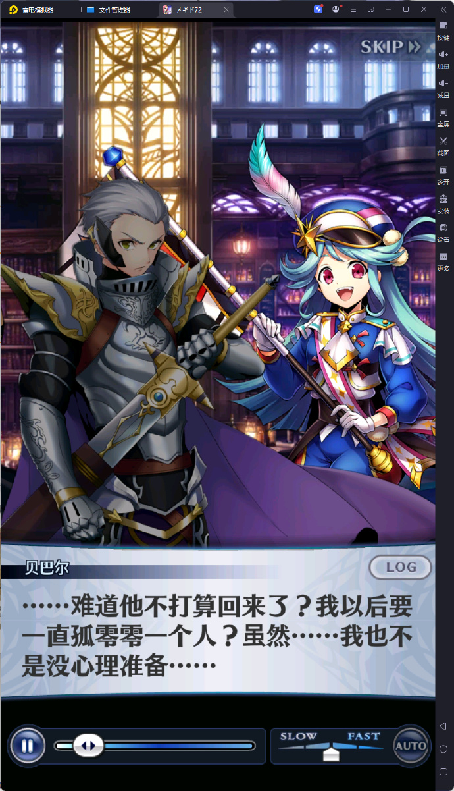

# Megido72 中文化工具说明

这个仓库的目的是分享一套面向小说、游戏等长文本项目的 LLM 翻译工作流，尤其是如何用 Claude Code / Codex 的校对命令发现和修复 AI 初翻里最常见、最危险的问题。

本人曾是一名业余日语翻译爱好者，参与过 Steam 版本《STEINS;GATE 0》和《STEINS;GATE ELITE》的简体中文翻译工作，也曾在民间作为《CHAOS;CHILD》简体中文爱好者翻译补丁项目的负责人。如今 LLM 快速发展，我已经意识到：小说、游戏这类过去需要大量人力的文本项目，正在变成可以由 AI 快速完成初稿、再由人和更强模型集中校对的工作。本次尝试和流程记录，是想把这部分经验分享出来。

本次研究对象是《メギド72》，一款已经停服但有离线版本的日本手游。它有丰富且高质量的剧情，也非常适合作为 AI 游戏翻译工作流的压力测试。选择它主要有两个理由：

- 文本加密和资源结构相对简单，不需要把大量时间花在拆包逆向上。
- 作为 AI 翻译项目难度极高：文本量巨大，角色、地名、组织名、技能名很多，还有大量让人恼火的片假名和典故。

如果 AI 能在这个项目上跑出基本可游玩的结果，那么这套流程对其他文本量更小、术语更少的项目会更有参考价值。当然，AI 翻译一定会有错误；译名统一也一定会出问题，除非术语表由人工维护，并随着项目进度持续更新。

这也是本仓库最想强调的部分：AI 初翻很快，但它一定会犯错，所以必须把“如何校对 AI 翻译”当成一个独立问题来处理。就算给了术语表和提示词，AI 仍然会出现这些问题：

- 译名表遗忘（本质上仍是概率模型，不是数据库检索器；即使提示词写了，也会时不时忘记）。
- 日文残留（偷懒，或者在长文本批处理中直接把原文放过去）。
- 过度音译（日语有时会出现片假名写成的完整句子，这种时候模型很容易把本应意译的句子全部音译）。
- 混入思考过程（混入解释、道歉等）
- 翻译膨胀 / AI 工作中的胡言乱语（AI 幻觉 + 流口水；简单句被扩写成一大段，奇怪语言，上下文污染成复读机）。

这个项目的校对 workflow，主要就是为了系统性地定位这些问题。

## 示例截图

下面几张图展示了补丁在离线版中运行时的效果，包括主界面文本、技能文本、角色资料和剧情对白：

| 主界面 / 大厅文本 | 技能和战斗文本 |
|---|---|
|  |  |

| 角色资料 | 剧情对白 |
|---|---|
|  |  |

一般翻译项目可以粗略分为四步：

```text
1. 初翻
2. 校对
3. 润色
4. 封包和 debug
```

本项目的初翻使用 [AiNiee](https://github.com/NEKOparapa/AiNiee) 调用 Gemini 3.1 Pro 和 Gemini 3 Flash。Pro 成本太高，所以中途切换到了 Flash。校对在真人翻译流程里通常是最需要水平的环节，本项目主要使用 Claude Code 的 Opus 4.6 配合仓库里的校对命令完成。项目没有专门进行完整润色；封包和 debug 主要交给 Codex。实际使用时，校对和封包 debug 由同一个 agent 完成也是完全可行的。

这个仓库只保存可复用工具、校对命令、纯净日文 unique 文本和最终术语表，不保存原始游戏资源、APK、解包后的数据库、大型翻译文件、签名密钥或生成物。

## 目录
```text
tools/
  extract_japanese_text.py      # 从 MVGL 中解包数据库并提取日文文本
  split_translated_texts.py     # 将行对齐中文译文拆回各个源表
  pack_translated_mvgl.py       # 写回 SQLite 数据库并重新封包 MVGL
  patch_apk_assets.py           # 将封好的 MVGL 替换进 APK
  sign_apk_with_signaturetools.py # 调用 SignatureTools 内置签名器签名 APK

.claude/commands/
  proofread-translation.md      # Claude Code / Codex 用的翻译校对命令

glossary/
  megido72_terms_ainee.json      # AiNiee 可用的共享术语表

data/
  japanese_text_unique.txt       # 纯净、去重、行对齐的日文文本
```

## 1. 提取文本

把游戏里的 MVGL 文件放到仓库根目录，至少需要：

```text
GKDB_offline.android.mvgl
GKDB_offline_episode.android.mvgl
GKDB_offline_win.android.mvgl
```

运行：

```powershell
python .\tools\extract_japanese_text.py .\GKDB_offline.android.mvgl .\GKDB_offline_episode.android.mvgl .\GKDB_offline_win.android.mvgl -o .\extracted_japanese_text
```

脚本会解包 MVGL，导出 SQLite 数据库，并生成后续拆分和封包需要的文本文件、TSV 和 manifest。

仓库同时保留了一份已经提取好的纯净日文 unique 文本：

```text
data/japanese_text_unique.txt
```

如果只是复用现有翻译流程，可以直接拿这份文件作为 AiNiee 和校对工具的日文源文本。

如果文件不在仓库根目录，也可以直接传入完整路径：

```powershell
python .\tools\extract_japanese_text.py D:\path\GKDB_offline.android.mvgl D:\path\GKDB_offline_episode.android.mvgl D:\path\GKDB_offline_win.android.mvgl -o .\extracted_japanese_text
```

## 2. 术语表和参考表

翻译前建议先准备术语表，至少包含角色名、地名、技能名、物品名、组织名、专有概念等。仓库里提供了一个 AiNiee 可直接使用的术语表：

```text
glossary/megido72_terms_ainee.json
```

术语表示例：

```json
[
  {
    "src": "メギド",
    "dst": "梅基多",
    "info": "核心专有名词"
  },
  {
    "src": "ヴァイガルド",
    "dst": "维加尔德",
    "info": "地名"
  }
]
```

需要注意：对 Megido72 这种文本量巨大、角色和捏他非常多的游戏，几乎不可能只靠 AI 一次性生成没有遗漏的参考表。如果追求质量，术语表应当随着翻译和校对持续补充 

## 3. 使用 AiNiee 初翻

我们使用 [AiNiee](https://github.com/NEKOparapa/AiNiee) 做第一轮机器翻译。本次项目实际调用过 Gemini 3.1 Pro 和 Gemini 3 Flash；前者质量更好但成本很高，后者更适合大批量初翻。

建议流程：

```text
1. 使用本仓库脚本提取日文唯一文本。
2. 将术语表导入 AiNiee。
3. 用 AiNiee 生成中日双语或行对齐中文文本。
4. 保证最终中文文件和日文 unique 文件行数完全一致。
```

不建议使用 AiNiee 内置的 AI 自动校对功能。实际测试中它容易污染译文，例如互换中日文本、引入额外解释、改坏已经正确的术语、让行对齐变得不可控。初翻后建议转入 Claude Code 或 Codex 做专门校对。

## 4. 使用 Claude Code / Codex 校对

仓库提供了校对命令：

```text
.claude/commands/proofread-translation.md
```

这个命令是本仓库最想分享的部分。把它放在项目的 `.claude/commands/` 目录后，可以让 Claude Code / Codex 按固定标准审查翻译。推荐两种模式：

```text
montecarlo; game; Japanese->Simplified Chinese; japanese_text_unique.txt; chinese_text_unique.txt; glossary/megido72_terms_ainee.json
split 500; game; Japanese->Simplified Chinese; japanese_text_unique.txt; chinese_text_unique.txt; glossary/megido72_terms_ainee.json
```

校对时主要处理这些问题：

- 错译、反译、主语或说话人错误。
- 术语表冲突，尤其是角色名、地名、技能名和专有概念。
- 日文残留、中日行互换、漏行、错位。
- 过度音译。人名可以音译，但普通句子必须意译成自然中文；片假名整句尤其需要检查。
- 翻译膨胀、废话变多、AI 幻觉或胡言乱语。
- AI 污染，例如解释性废话、道歉、括号备注、相邻行串入。
- 文本过长，导致游戏文本框显示不全。
- 富文本或控制语法被破坏，例如 `{font_megid}`、`{font_end}` 不能被换行拆开。

两种校对模式的区别：

- `montecarlo` 适合超大文本的风险发现。它会先按规则定位高风险区域，再做随机抽查，反复采样到问题收敛。它不能保证逐行无错，但能很快发现污染批次、错位区段、术语崩坏、未翻译残留等大问题。
- `split N` 适合正式修正。它按固定行数拆块逐段检查，可以对每个 chunk 做更细的行级校对，也更适合把修正写回中文文本。

校对命令内部的 HIGH 类问题主要覆盖几类 AI 翻译硬伤：意思错、主语错、术语错、未翻译、漏译、擅自加戏、AI 元文本泄漏、性别或称谓错误、机器翻译幻觉和异常膨胀。实践中，`montecarlo` 用来找病灶，`split N` 用来动手修，是比较有效的组合。

具体来说，workflow 会用几类信号来定位问题：

- 对比日文源文本和中文译文，检查行数、空行、疑似错位和中日互换。
- 用日文字符检测找出残留原文。
- 用术语表检查固定译名是否被模型忘掉或改写。
- 用长度比例和显示宽度找出异常膨胀的译文，这类句子往往是幻觉、加戏或文本框溢出的来源。
- 用规则保护富文本标签，避免自动换行把 `{font_megid}` 这类控制语法撕裂。
- 用 `montecarlo` 抽样先发现污染区段，再用 `split N` 分块细修，把问题从“凭感觉审稿”变成“先定位风险，再集中处理”。

`pack_translated_mvgl.py` 里包含通用的文本清理和自动换行逻辑：

- 压平无意义空白。
- 保留并保护富文本标签。
- 根据原日文换行和各文本区域的安全宽度重新换行。
- 对剧情文本限制显示行数，避免正文文本框溢出。
- 支持把少量人工修正放在本地 override 文件里，而不是写死进脚本。

如果某些剧情行需要人工缩短，可以建立本地 JSON：

```json
{
  "365544": "这里写人工缩短后的中文"
}
```

封包时传入：

```powershell
python .\tools\pack_translated_mvgl.py --story-overrides .\local_story_overrides.json
```

也可以使用 TSV，字段需要包含 `rowid`，以及 `text`、`translated_text` 或 `cn` 之一。

## 5. 封回数据库和 MVGL

校对完成后，准备行对齐译文文本。默认路径是：

```text
已翻译完成/chinese_text_unique.txt
```

然后运行一键封包：

```powershell
python .\tools\pack_translated_mvgl.py
```

常用参数：

```powershell
python .\tools\pack_translated_mvgl.py `
  --fortrans-root .\Fortransjp `
  --chinese-unique .\已翻译完成\chinese_text_unique.txt `
  --db-source .\extracted_japanese_text\databases `
  --output-root .\packed_translated
```

输出位置：

```text
packed_translated/mvgl/
  GKDB_offline.android.mvgl
  GKDB_offline_episode.android.mvgl
```

中间生成的数据库和报告在：

```text
packed_translated/databases/
packed_translated/pack_report.json
```

如果只想先把翻译拆成每个原表对应的 txt/tsv，可以单独运行：

```powershell
python .\tools\split_translated_texts.py --fortrans-root .\Fortransjp --chinese-unique .\已翻译完成\chinese_text_unique.txt
```

## 6. 封入 APK 和签名

先准备原版 APK，例如：

```text
apk/com_dena_a12021245_v2.0.1.apk
```

将封好的 MVGL 写入 APK：

```powershell
python .\tools\patch_apk_assets.py --apk .\apk\com_dena_a12021245_v2.0.1.apk --replacements-dir .\packed_translated\mvgl --output .\patched_apk\com_dena_a12021245_v2.0.1_cn_unsigned.apk
```

这个脚本使用 Python 标准库直接替换 APK zip 内的资源，更新 `assets/offlinechecksumcache` 中对应 MVGL 的 CRC，并移除旧签名条目。因此输出是未签名 APK，必须重新签名后才能安装。

## 6. 封入 APK 和签名

先准备原版 APK，例如：

```text
apk/com_dena_a12021245_v2.0.1.apk
```

将封好的 MVGL 写入 APK：

```powershell
python .\tools\patch_apk_assets.py --apk .\apk\com_dena_a12021245_v2.0.1.apk --replacements-dir .\packed_translated\mvgl --output .\patched_apk\com_dena_a12021245_v2.0.1_cn_unsigned.apk
```

这个脚本本身不调用 apktool，也不调用 Java 签名器；它使用 Python 标准库直接替换 APK zip 内的资源，更新 `assets/offlinechecksumcache` 中对应 MVGL 的 CRC，并移除旧签名条目。因此输出是未签名 APK，必须重新签名后才能安装。

推荐签名方式：

### 方式 A：Windows 下使用 SignatureTools

如果电脑没有配置系统级 Java，可以使用 [SignatureTools](https://github.com/DeMonJavaSpace/SignatureTools)。这是我们本地实际使用的签名工具。我们提供了Python 脚本调用 SignatureTools 自带的 `zipalign.exe` 和内嵌签名 launcher。

示例：

```powershell
python .\tools\sign_apk_with_signaturetools.py `
  --tool-root D:\path\to\SignatureTools `
  --input-apk .\patched_apk\com_dena_a12021245_v2.0.1_cn_unsigned.apk `
  --output-apk .\patched_apk\com_dena_a12021245_v2.0.1_cn_signed.apk `
  --keystore D:\path\to\your_key.jks `
  --key-alias your_alias `
  --store-password your_store_password `
  --key-password your_key_password
```

脚本会先 `zipalign`，再调用 SignatureTools 的签名命令，最后执行 verify。签名完成后，使用生成的 signed APK 安装。


### 方式 B：使用 Java / Android SDK 工具

如果电脑已经安装 Java 或 Android SDK，也可以使用：

- [uber-apk-signer](https://github.com/patrickfav/uber-apk-signer)
- Android SDK 自带 `apksigner`

这类方式需要本机能运行对应的 `java` 或 SDK 命令。

## 7. 安装打包后的 APK

如果希望继承本机或模拟器里已经下载好的游戏数据，可以按下面的顺序操作。开始前请务必备份游戏数据目录。

1. 确认设备里已经存在游戏数据目录，并且内部文件完整：

```text
Android/data/com.dena.a12021245/
```

2. 将打包生成的 MVGL 文件复制进去，覆盖该目录中的同名文件。覆盖前建议先备份原文件。

```text
GKDB_offline.android.mvgl
GKDB_offline_episode.android.mvgl
```

3. 把数据目录 `com.dena.a12021245` 临时改成任意其他名字，例如：

```text
com.dena.a12021245_backup
```

4. 卸载原版 `メギド72`。

5. 安装你重新打包并签名后的新版 `メギド72` APK。

6. 在第一次启动游戏之前，把刚才临时改名的数据目录改回：

```text
com.dena.a12021245
```

7. 启动游戏。

## 重要注意事项

- 本仓库不分发任何游戏原始资源或APK，相信megido72玩家自己都有。
- 文本行数必须和提取出的日文 unique 文件完全对齐。
- 要达到真实可商业使用的质量，还是必须得人工校对，但提供的工作路线和校对skill理论上能极大提升效率。

 
